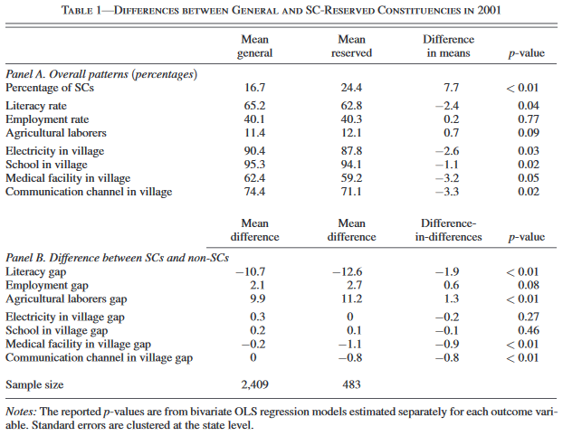
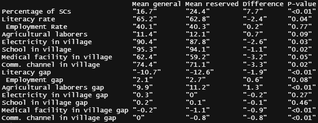
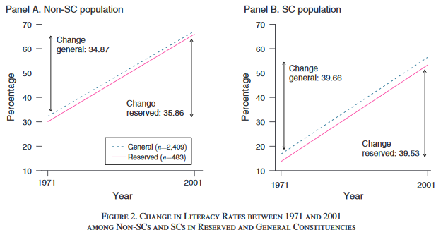
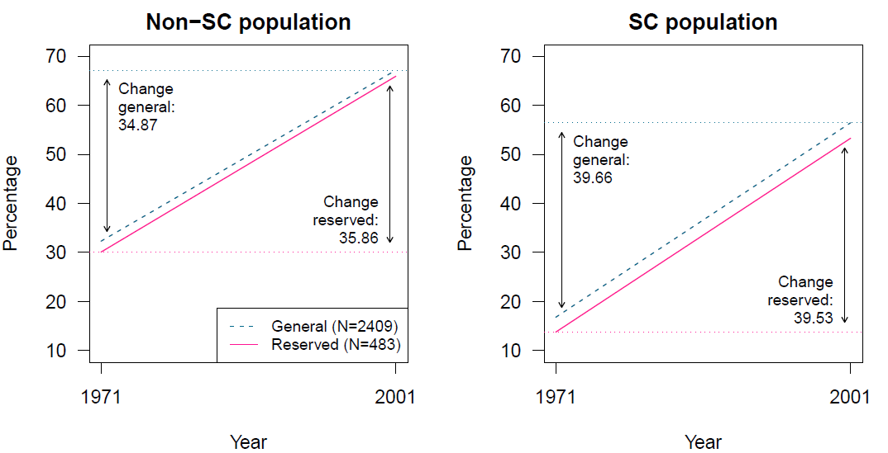
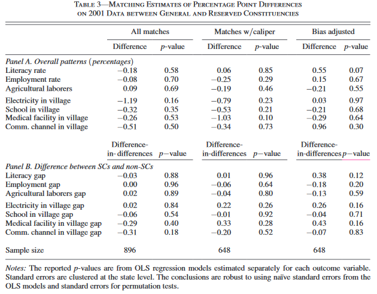
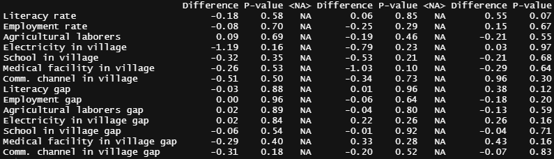

# Topics in Development Economics (PhD course)

Course by Peter Brummund S2021

Repo for replication study and extension 

Here is a nice [R-blog](https://www.r-bloggers.com/2019/02/finding-economic-articles-with-data/) on 'Finding Economic Articles With Data', introducing a [Shiny app](http://econ.mathematik.uni-ulm.de:3200/ejd/) that allows to search for articles that have an accessible data and code supplement.

## Problem Set 1:  Replicate 2 tables

I selected the paper 'The Role of Information in Agricultural Technology Adoption: Experimental Evidence from Rice Farmers in Uganda' by Bjorn Van Campenhout published in Economic Development and Cultural Change 2021 69:3, 1239-1272.

Paper: https://www.journals.uchicago.edu/doi/10.1086/703868

Dataset incl. code: https://dataverse.harvard.edu/dataset.xhtml?persistentId=doi:10.7910/DVN/2RORMS&version=1.0 

The paper seemed to be straight forwardly replicable, because it offers one R script and one data file. So it should be easy to just run the provided code, see `replication_VanCampenhout2019.R`. However, the code already yields an error in line 35, apparently because the subsetting of the data is not correctly specified. I tried to continue and thought of maybe manually fixing the issue later, until I noticed a fatal problem, making it impossible to replicate the study out of the box: In line 83, the author reads additional data, which is not provided in the dataset stated above. My replication plan failed very early.  

## Problem Set 1:  Replicate 2 tables - second try

As a second try, I chose 'Development from Representation? A Study of Quotas for the Scheduled Castes in India' by Francesca Refsum Jensenius published in the American Economic Journal: Applied Economics 2015, 7 (3): 196-220. This was the first article when searching for 'development' and a study using R code in above mentioned app.

Paper: https://www.aeaweb.org/articles?id=10.1257/app.20140201

Dataset incl. code: https://www.openicpsr.org/openicpsr/project/113613/version/V1/view

For my replication, see `replication_FRJ2019.R`.

Table 1 can be perfectly replicated:

Replication works also well for Figure 1:

As a second example, I chose Table 3, also working like a charm:

