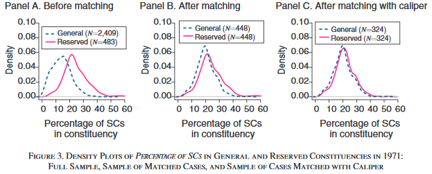
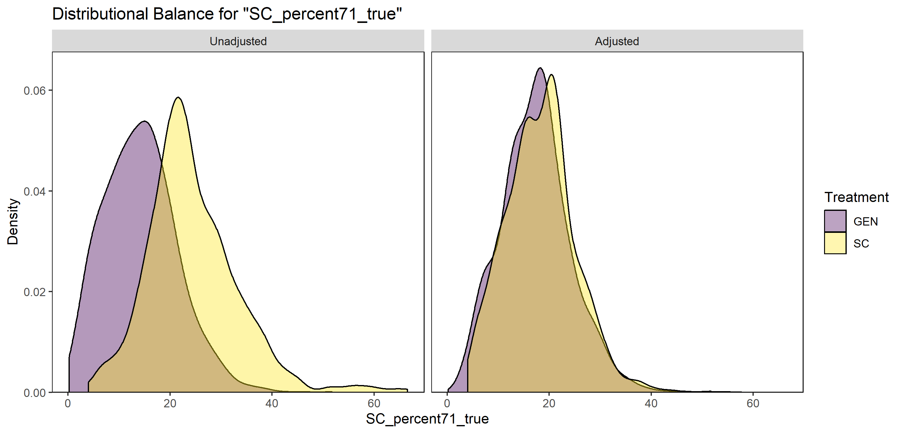
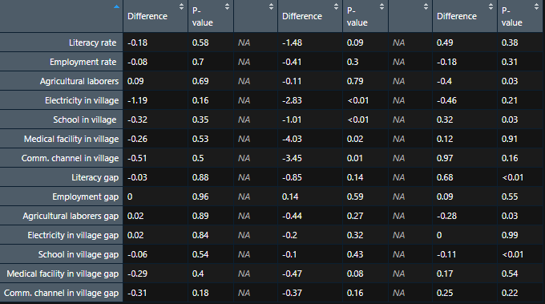

# Topics in Development Economics (PhD course)

Course by Peter Brummund S2021

Repo for replication study and extension 

Here is a nice [R-blog](https://www.r-bloggers.com/2019/02/finding-economic-articles-with-data/) on 'Finding Economic Articles With Data', introducing a [Shiny app](http://econ.mathematik.uni-ulm.de:3200/ejd/) that allows to search for articles that have an accessible data and code supplement.

## Problem Set 1:  Replicate 2 tables

I selected the paper 'The Role of Information in Agricultural Technology Adoption: Experimental Evidence from Rice Farmers in Uganda' by Bjorn Van Campenhout published in Economic Development and Cultural Change 2021 69:3, 1239-1272.

Paper: https://www.journals.uchicago.edu/doi/10.1086/703868

Dataset incl. code: https://dataverse.harvard.edu/dataset.xhtml?persistentId=doi:10.7910/DVN/2RORMS&version=1.0 

The paper seemed to be straight forwardly replicable, because it offers one R script and one data file. So it should be easy to just run the provided code, see `replication_VanCampenhout2019.R`. However, the code already yields an error in line 35, apparently because the subsetting of the data is not correctly specified. I tried to continue and thought of maybe manually fixing the issue later, until I noticed a fatal problem, making it impossible to replicate the study out of the box: In line 83, the author reads additional data, which is not provided in the dataset stated above. My replication plan failed very early.  

## Problem Set 1:  Replicate 2 tables - second try

As a second try, I chose 'Development from Representation? A Study of Quotas for the Scheduled Castes in India' by Francesca Refsum Jensenius published in the American Economic Journal: Applied Economics 2015, 7 (3): 196-220. This was the first article when searching for 'development' and restricting the search to R code in above mentioned app.

Paper: https://www.aeaweb.org/articles?id=10.1257/app.20140201

Dataset incl. code: https://www.openicpsr.org/openicpsr/project/113613/version/V1/view

For my replication, see `replication_FRJ2019.R`.

Table 1 can be perfectly replicated:

Replication works also well for Figure 1:

As a second example, I chose Table 3, also working like a charm:

## Problem Set 2:  Conduct 2 robustness checks

In a second step, we try to examine the robustness of the main results and extend the econometric analysis of the selected study. I build upon the second try study of Problem Set 1 by Francesca Refsum Jensenius (2015). The modified code can be found in `problem_set_2.R`.

For my robustness checks, I turn the spotlight on the matching strategy that is applied in the paper to reduce bias resulting from systematic treatment assignment. In her paper, Francesca Refsum Jensenius estimates the constituency-level development effect of quotas for the Scheduled Castes (SCs) in India. In the 1970s, a number of Indian constituencies (political districts) were declared 'reserved'. As stated in the paper, 'In reserved constituencies only individuals belonging to an SC community  may  run  for  election,  while  the  whole  electorate  of  that  constituency  votes' (p. 197). However, quotas were assigend systematically, not randomly. The author applied a simple matching strategy to reduce the bias resulting from this selection problem. She used an exact matching strategy without replacement and matched on the original variables used in selecting the reserved seats in th 1970s. In doing so, she obtained a sample of pairs of treated and control constituencies. Most pairs were formed of the constituency with the highest share of SCs within a certain electoral district (reserved, i.e. treatment) and the one with the second highest share ('general', i.e. not reserved and hence the control observation). My idea was to be less restrictive on the matching and allow for a larger control group, i.e. all general constituencies that were comparable in their characteristics with those of reserved constituencies. In order to do so, I applied the Coarsened Exact Matching (CEM) approach advocated by Iacus and King (2009). Lots of information why this approach is so useful and flexible as well as software to implement CEM can be found [here](https://gking.harvard.edu/cem).

Comparing the balance of the sample before and after matching yields similar results as compared to the paper: 

While the paper uses a sample of 448 treated and 448 control observations (in a more rigorous matching, the author then also restricted the sample to 324-324), I obtained 365 reserved constituencies and a control group of 1136. For 118 treated constituencies, the algorithm could not find any fitting matches.

I then used the new sample to re-estimate results shown in Table 3 of the original paper (see Problem Set 1). My robustness checks based on the new matching strategy were twofold. First, I followed the paper's code very closely and compared 365 treated to 1136 control constituencies in an OLS setting. Second, used the same sample, but weighted all observations based on weights that I received from the matching algorithm. Results are shown in the table below. The first two columns replicate columns 1 and 2 from the original Table 3. Columns 3 and 4 refer to my first estimation based on CEM, and columns 5 and 6 show the results using the weighted OLS setting. 

To facilitate a comparison of results, I modified the original Figure 4 in a way such that I only kept the author's non-adjusted matching estimates and added my two models' coefficient estimates and the respective 95% confidence intervals:

For most of the development indicators used in the study, my robustness checks yield similar interpretations. The selected paper demonstrated that there was no evidence that quotas affected constituency-level development (supporting narratives both in favour and against quotas). My first alternative model using CEM ('CEM est.') tends to yield larger confidence bounds for about half of the development indicators. This is not surprising, as CEM allowed for a larger control group and hence more variation, while the original matching only used the one most similar observation (in terms of SC share) of each treated constituency for its control group. However, I also find that some coefficiant estimates are significantly different from zero: According to this model, reserving political positions for SCs negatively influence the development indicators electricity in village, school in village, medical facility in village and communication channel in village. The second model ('CEM weighted est.'), on the other hand, finds a slightly positive effect on the literaciy gap indicator. All in all, results were pretty robust against my checks. From the analysis, it is yet apparent that the decision of a matching strategy alone may influence the results of a study. 

